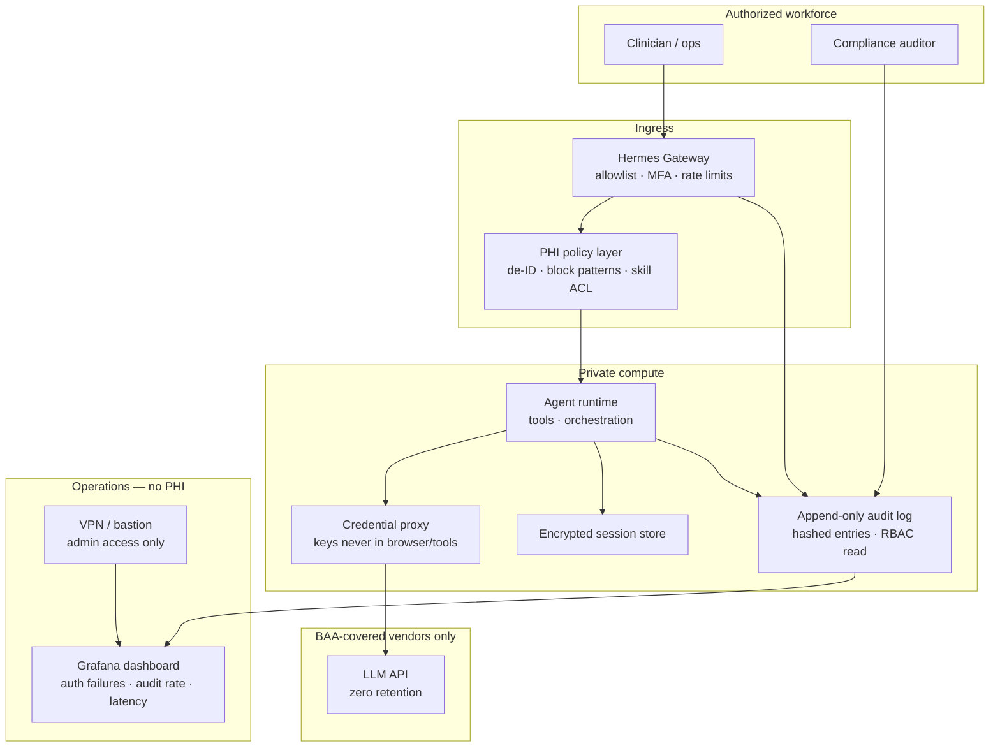
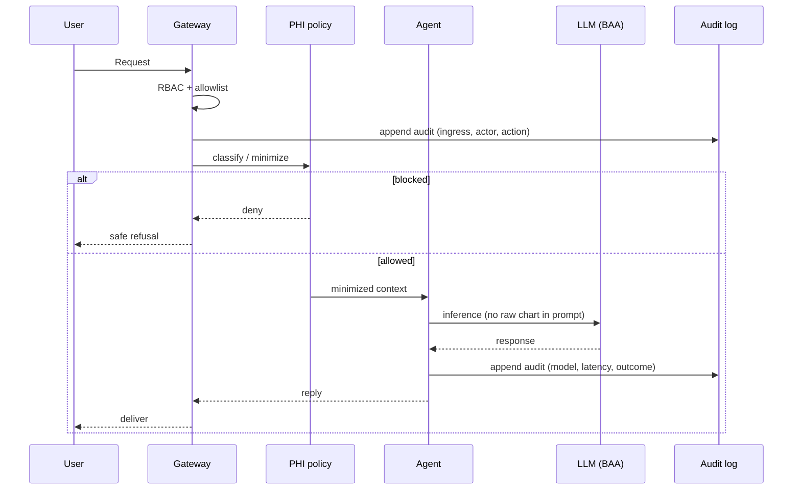

# HIPAA-aligned Hermes — reference architecture

> **Publication status:** Q12 **Option B — reference architecture only**. Not a depiction of any single client system.

## Diagrams (exportable)

| Diagram | File |
|---------|------|
| **Trust zones + components** | [`diagrams/hipaa-hermes-architecture.svg`](./diagrams/hipaa-hermes-architecture.svg) |
| **Request flow** | [`diagrams/hipaa-hermes-request-flow.svg`](./diagrams/hipaa-hermes-request-flow.svg) |


---

## Purpose

Self-hosted **inference gateway** for workforce AI assistants in HIPAA-regulated environments. PHI stays inside the trust boundary; vendors only see minimized, contracted traffic.

This is the target shape for `hipaa-hermes-agent` v1 — skeleton implementation, not production certification.

---

## Trust zones

```
┌─────────────────────────────────────────────────────────────────┐
│  ZONE A — External (BAA required for any PHI)                   │
│  Slack Enterprise · LLM API (ZDR) · optional FHIR read API      │
└────────────────────────────┬────────────────────────────────────┘
                             │ TLS 1.2+
┌────────────────────────────▼────────────────────────────────────┐
│  ZONE B — Gateway DMZ (single ingress)                          │
│  Hermes Gateway · auth · rate limit · PHI policy pre-check      │
└────────────────────────────┬────────────────────────────────────┘
                             │ private network
┌────────────────────────────▼────────────────────────────────────┐
│  ZONE C — Agent + ePHI                                        │
│  Agent runtime · encrypted sessions · RAG · append-only audit   │
│  No public ports · no quick tunnels · secrets from vault          │
└────────────────────────────┬────────────────────────────────────┘
                             │ redacted metrics only
┌────────────────────────────▼────────────────────────────────────┐
│  ZONE D — Ops (no PHI in logs)                                  │
│  VPN-only Grafana · alerting · encrypted backups                │
└─────────────────────────────────────────────────────────────────┘
```

---

## Component diagram



---

## Request flow



---

## HIPAA control mapping (v1 focus)

| Safeguard | Implementation |
|-----------|----------------|
| Access control | Two RBAC roles: `operator`, `auditor` |
| Audit controls | Append-only hashed log; no delete API |
| Integrity | Per-entry SHA-256; immutable SQLite WAL |
| Transmission | TLS termination at gateway; no public debug tunnels |
| Minimum necessary | PHI policy gate (`policy.rs`) before LLM call |
| Encryption at rest | v2: encrypted volume / Postgres TDE |

---

## v1 repo mapping

| Architecture box | v1 code |
|------------------|---------|
| Audit log | `crates/hermes/src/audit.rs` |
| RBAC | `crates/hermes/src/auth.rs` |
| Gateway (minimal) | `crates/hermes` — Axum API |
| PHI policy layer | `crates/hermes/src/policy.rs` |
| Grafana | `deploy/grafana/hipaa-hermes-observability.json` |

---

## What production adds (not v1)

- Signed BAAs with Slack, cloud host, LLM vendor
- Secrets manager (not `.env` on disk)
- Encrypted Postgres for sessions
- SIEM integration (optional; Loki included in local `deploy/docker-compose.yml`)
- Formal risk assessment and workforce training

---

## Export notes (Day 2)

1. Complete [Q12_PUBLICATION.md](./Q12_PUBLICATION.md) before publishing externally.
2. Export diagram: Mermaid in this file → PNG via IDE or [mermaid.live](https://mermaid.live).
3. For Upwork portfolio: use the **trust zones** ASCII box + component diagram only — no client metrics.
